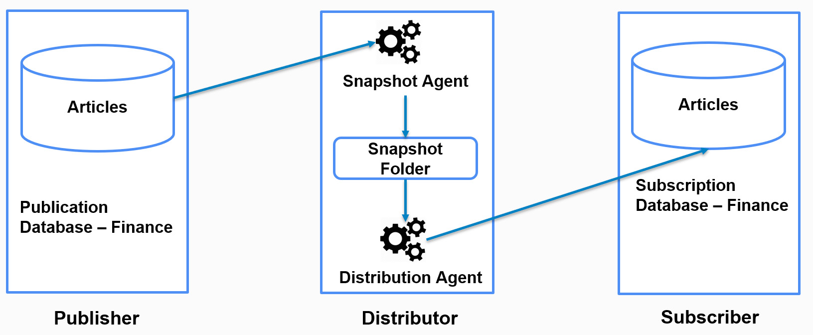
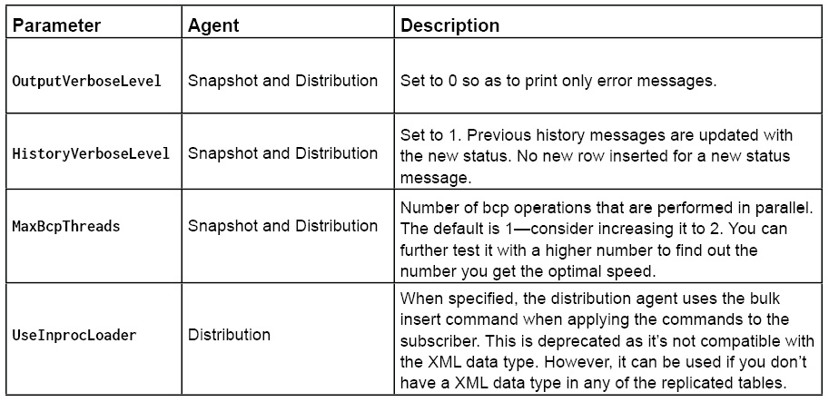

Git repo: https://github.com/TrainingByPackt/Professional-SQL-Server-High-Availability-and-Disaster-Recovery
# Getting Started with SQL Server HA and DR
## SQL Server HA and DR Solutions
### Windows Server Failover Cluster Installation
- Commonly known as FCI, this requires SQL Server to be installed as a cluster service on top of the Windows failover cluster.
### Log Shipping
- one of the oldest SQL Server solutions, and is mostly used for DR and SQL Server migration.
- It takes transaction log backups from the primary server and restores them on one or more secondary servers. It is implemented using SQL Agent jobs.
### AlwaysOn Availability Groups
- one of the newest and most impressive HA and DR features in SQL Server.
- it worked on top of Windows Server Failover Cluster; however, this restriction has been removed in Windows Server 2016 and SQL Server 2016.
- AlwaysOn Availability Groups allows you to manually or automatically fail over one or more databases to a secondary instance if the primary instance is unavailable.
### Replication
- one of the oldest SQL Server features that replicates data from one database (commonly known as a publisher) to one or more databases (known as subscribers) in the same or different SQL Server instances.
- commonly used for load balancing read and write workloads.
- The writes are done on the publisher and reads are done on the subscriber.
- also used as an HA and DR solution.
### Hybrid Scenarios
- Using one feature doesn't restrict you from using others.
- A company can choose AlwaysOn for the transactional database and log shipping/replication for the logging database.
### Note
- There are other solutions such as database mirroring and third-party solutions.
- Database mirroring is deprecated and will be removed in future SQL Server versions.

## Introduction to SQL Server Replication 
- Replication is a SQL Server feature that synchronizes data from a database (known as a publisher) to one or more databases (known as subscribers) on the same or different SQL Server instances.
Components:
- Publisher: A publisher is a database that facilitates the data for replication.
- Publication: A publication is a set of objects and data to replicate. A publisher (database) can have one or more publications.
- Articles: Articles are the database objects that are to be replicated such as tables and stored procedures. A publication can include one or more selected database objects and data.
- Distributor: A distributor is a database (distribution database) that stores the data to be replicated from one or more publishers. The distribution database can be on the same instance as the publisher (which happens in most cases) or can be on a different SQL Server instance. Created as part of the replication database, it also stores the replication metadata such as publisher and subscriber details.
- Subscriber: A subscriber is a database that subscribes to one or more publications from the one or more publishers in order to get the replicated data. A subscriber can also update the publisher data in case of merge or peer-to-peer transactional replication. A subscriber database can be on the same SQL Server instance as the publisher or on a different SQL Server instance.
- Subscription: Subscription is the opposite of publication. The subscriber connects to the publisher by creating a subscription for the given publication. There are two types of subscriptions, push and pull subscriptions. **Push subscription**, the distributor updates the subscriber as and when data is received (distribution agent is at distributor).  **Pull subscription**, the subscriber asks the distributor for any new data changes, as scheduled (distribution agent is at the subscriber).
### Replication Agents
Replication agents are the standalone executables that are responsible for replicating the data from a publisher to a subscriber.
#### Snapshot Agent
- The snapshot agent creates the selected articles and copies all of the data from the publisher to the subscriber whenever executed.
- the subsequent execution of the agent doesn't copy the differential data; rather, each run clears out the existing schema and data at the subscriber and copies the schema and data from the publisher.
- The snapshot agent is run at the distributor and is used via snapshot replication.
#### Log Reader Agent
- scans the transaction log for the transactions marked for replication and inserts them into the distribution database.
- used only in transactional replication and provides continuous replication from the publisher to the subscriber.
- Each publication has its own log reader agent; that is, if there are two different databases with transactional replication, there will be two log reader agents, one for each database.
- runs at the distributor.
#### Distribution Agent
- the distribution agent distributes (applies) the data that's inserted into the distribution database by the log reader agent to the subscribers.
- runs at the subscriber if it's a pull subscription and at the distributor if it's a push subscription.
#### Notes:
There's also a queue reader agent that's used in bidirectional transactional replication. Bidirectional transactional replication is now obsolete.

#### Merge Agent
-  merge agent applies the initial snapshot to the subscriber (generated by the snapshot agent) and then replicates the changes from the publisher to the subscriber and from the subscriber to the publisher as and when they occur, or when the subscriber is online and available for replication.
-  There is one merge agent for one merge subscription.
## Types of Replication
### Transactional Replication
- replicates the transactions as and when they are committed at the publisher to the subscribers.
- one of the most commonly used replications to load balance read-write workloads.
- The writes are done at the publisher and the reads (or reporting) are done at the subscriber, thereby eliminating read-write blocking.
-  the subscriber database can be better indexed to speed up the reads and the publisher database can be optimized for Data Manipulation Language (DML) operations.
-  The agents are implemented as SQL agent jobs, that is, there's a SQL agent job for a log reader agent and a SQL agent job for the distribution agent.
-  two other transactional replications that allow changes to flow from subscriber to publisher: transactional replication with updatable subscription (bidirectional transactional replication) and peer-to-peer transactional replication.
### Merge Replication
- replicates changes from publishers to subscribers and from subscribers to publishers.
- Merge replication has a built-in mechanism to detect and resolve conflicts; however, in some cases, it may get difficult to troubleshoot conflicts. This makes it the most complex replication type available in SQL Server.
- Merge replication uses the merge agent to initialize subscribers and merge changes. Unlike transaction replication, where the snapshot agent is used to initialize subscribers, in merge replication, the snapshot agent only creates the snapshot. The merge agent applies that snapshot and starts replicating the changes thereafter.
### Snapshot Replication
- Snapshot replication generates a snapshot of the articles to be replicated and applies it to the subscriber.
- The snapshot replication can be run on demand or as per schedule. It's the simplest form of replication and is also used to initialize transactional and merge replication.
<<<<<<< HEAD
=======

>>>>>>> master
### Configuring Snapshot Replication Using SQL Server Management Studio
## Optimizing Snapshot Replication
### Snapshot Replication Best Practices
#### Minimizing Logging at Subscriber
Snapshot replication uses bcp to bulk insert data from the publisher to the subscriber database. It's therefore advised to switch to a bulk-logged or simple recovery model to minimize logging and optimize bulk insert performance.

https://learn.microsoft.com/en-us/sql/relational-databases/backup-restore/recovery-models-sql-server?view=sql-server-2017

#### Minimizing Locking
- snapshot generation applies exclusive locks on tables until the snapshot is generated. This stops any other applications from accessing the tables, resulting in blocking.

Options to minimize blocking:
- **Change the isolation level to read-committed snapshot to avoid read-write blocking**. You'll have to research and find out how the read-committed snapshot will not affect any other application or functionality of your environment.
- Another way to avoid read-write blocking is to selectively use the **NoLock query hint**. This is not a good practice; however, it's being used in many applications to fix read-write blocking.
- **Schedule snapshot generation at off-peak hours** when there is less workload on the server.
#### Replicating Only Required Articles
Replicating all articles in a large database will take time and resources for snapshot generation.
#### Using Pull Subscription
- In pull subscription, the distribution agent is on the subscriber and not on the distributor. This reduces workload on the distributor. Moreover, if the publisher is acting as its own distributor, its workload is reduced.
#### Compressing the Snapshot Folder
compress snapshot files in the .cab format. This reduces the size of the snapshot files and speeds up network transfer. However, it takes time to compress the files by the snapshot agent and decompress by the distribution agent.

### Modifying Agent Parameters

