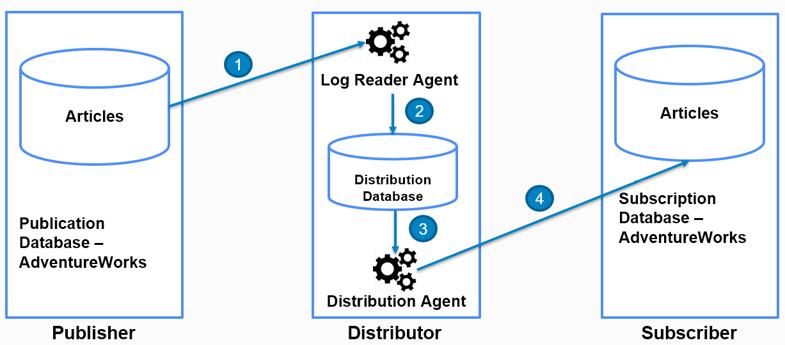
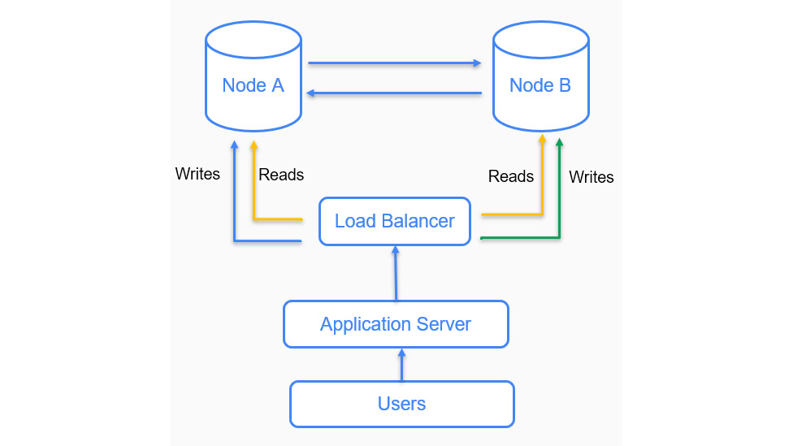

# Transactional Replication

## Understanding Transactional Replication
Once initialized, the transactions are replicated as follows:
- Steps 1 and 2: The log reader agent continuously scans for committed transactions in the publisher database transaction log and inserts the transactions to be replicated into the distribution database.
The log reader agent is at the distributor or at the publisher if the publisher acts as its own distributor.
- Steps 3 and 4: The distribution agent reads the transactions from the distribution database and applies them to the subscriber. The distribution agent is at the distributor if it's a push subscription and at the subscriber if it's a pull subscription.

## Configuring Transactional Replication

## Understanding Peer-To-Peer Transactional Replication
- Peer-to-peer replication, also referred to as master-master replication, is built upon transactional replication in which changes at the subscriber are also replicated to the publisher.
- A peer-to-peer topology consists of two or more databases where a change in each node (database) gets replicated at every other node (database) in the topology. Peer-to-peer replication therefore provides a scalable high availability solution.

Node A and Node B are in a peer-to-peer replication. Any changes made at Node A are replicated to Node B and any changes made at Node B are replicated to Node A.

This topology has the following benefits:

- Reads are load-balanced between two nodes, thereby optimizing the read performance.
- Writes are load-balanced between two nodes. For example, let's say there is a customer table that stores customer information. Customer information can be distributed between the two nodes based on location (or any other logic). Each node will have all customer data as the information is replicated. Similarly, updates can also be load-balanced.
- It provides high availability in case a node goes down because of a hardware or application failure. The load balancer automatically redirects the users to the active (working) node. As the nodes are part of replication, each node has all the data.

peer-to-peer replication may result in a conflict when the same row is updated/inserted/deleted at multiple nodes at the same time. 

## Configuring Peer-To-Peer Transactional Replication
Configuring P2P replication consists of the following steps:

- Creating the publication and adding articles to the publication on Server 1.
- Creating the subscription and then pushing the subscription agent (distribution agent) on Server 1.
- Taking the backup of the AdventureWorks database on Server 1. Unlike standard transactional replication, P2P transactional replication is initialized using backup.
- Restoring the AdventureWorks database from Server 1 on Server 2.
- Creating the publication and adding articles to the publication on Server 2.
- Creating the subscription and pushing the subscription agent on Server 2.

