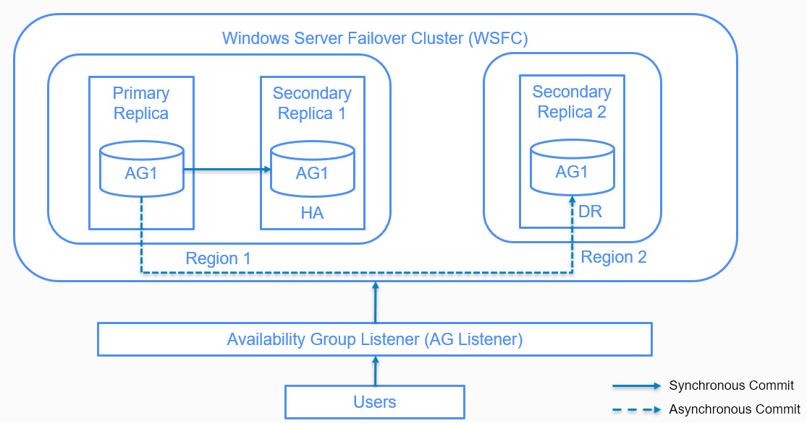
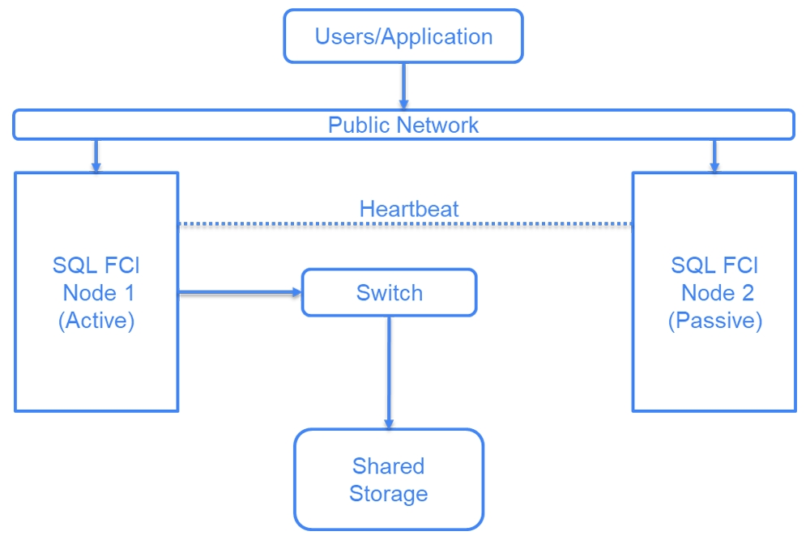
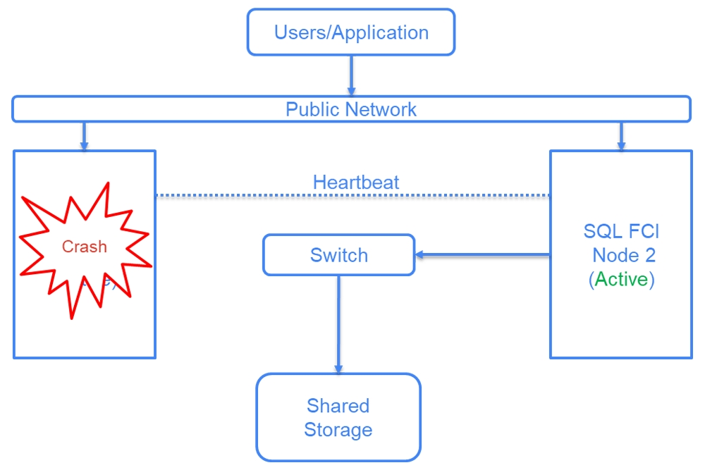
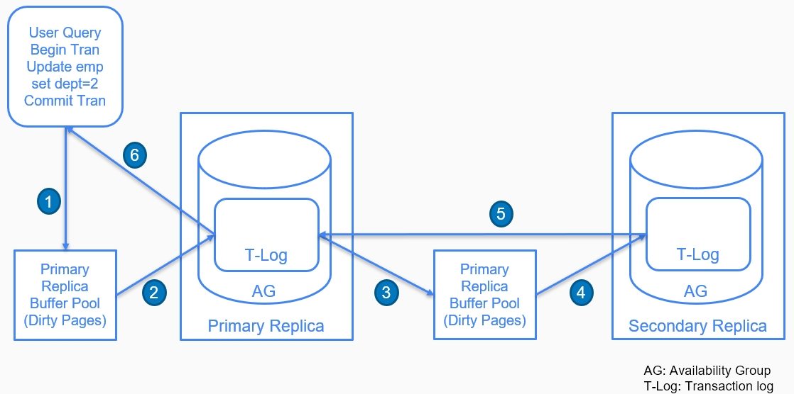
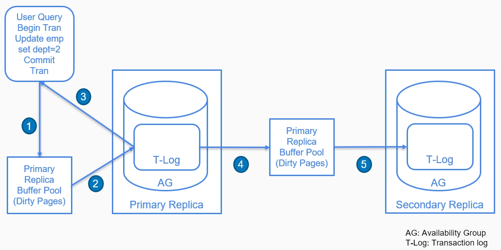

# AlwaysOn Availability Groups

## AlwaysOn Availability Group Concepts and Terminology
- AlwaysOn availability group: a group of databases that can fail over from a primary server to a secondary server automatically or manually, as and when required.
- Commonly known as AlwaysOn AGs, they're the premium high availability and disaster recovery solution available in SQL Server.
- Other than being an HA and a DR solution, it can also be used to load-balance read workloads, for maintenance jobs such as backups, and for consistency checks on the secondary databases.
### Availability Groups Concepts and Components

The given AlwaysOn implementation consists of three replicas or nodes: Primary Replica, Secondary Replica 1, and Secondary Replica 2. The three nodes are part of the same domain name and the same Windows Server Failover Cluster.

An AlwaysOn AG consists of the following components:
1. **Windows Server Failover Cluster** (WSFC) consists of two or more servers and is used to provide high availability (or scalability) for applications such as SharePoint, SQL Server, and many more.

WSFC was one of the more common solutions for high availability before AlwaysOn. A typical WSFC for SQL Server (commonly known as Failover Cluster Instance (FCI)) implementation for HA (without AlwaysOn) is shown in the following diagram:

**Note:**
SQL Server Failover Cluster Instance installation here refers to a SQL Server clustered installation on a Windows Server Failover Cluster.

- A typical WSFC implementation consists of two nodes (individual servers): Node 1 and Node 2. 
- The two nodes are part of a Windows Server Failover Cluster. 
- SQL Server is installed on each node (cluster installation and not standalone installation).
- The SQL Server database files (.mdf, .ldf, and .ndf) are kept in shared storage accessible from both nodes through a network switch.

- The heartbeat connection between the two nodes helps to find out whether a node is online.
-  In the case of a failure at Node 1 (the active node), Node 2 becomes active automatically and starts accepting user connections.
- The failover from Node 1 to Node 2 (active to passive) is taken care of by WSFC. Once WSFC finds out that Node 1 is offline, it moves the SQL Server service to Node 2 automatically. 
- There are a few seconds of downtime involved during the failover

- The AlwaysOn AG utilizes the failover capability of WSFC to fail over between nodes as and when required.
- A major difference between AlwaysOn and FCI is that the FCI uses shared storage, which becomes the single point of failure.

https://learn.microsoft.com/en-us/sql/database-engine/availability-groups/windows/failover-clustering-and-always-on-availability-groups-sql-server?view=sql-server-2017

2. **Availability Group and Availability Database**
- An availability group or AG is a set of databases that fail together. An availability database is a database that is a part of an availability group. 

**Note:**
Server objects such as logins and SQL Server agent jobs are not part of AGs and do not fail over.

3. **Basic Availability Groups**
- Basic availability groups, available in the SQL Server Standard edition, uses a subset of availability groups in the SQL Server Enterprise edition.
- A basic availability group is essentially a replacement of the database mirroring feature (deprecated) and offers AlwaysOn for one availability database for a maximum of two replicas. 
- The secondary database isn't readable and is only available in the case of failover when the secondary replica takes over as the primary replica.

Basic availability groups have the following limitations:
- Available only with SQL Server 2016 CTP3 Standard edition onward
- Maximum of two replicas: one primary and one secondary
- No read access, database backups, and integrity checks on the secondary replica
- Limited to only one availability database
- Can't be upgraded to advanced availability groups and can't be part of distributed availability groups

4. **Distributed Availability Groups**
-  a group of two separate availability groups. (From version 20216 onwards)
-  The two availability groups that are part of a distributed availability group can be on-premises or on the cloud and don't need to be at the same location. 
- The availability groups can be cross domain, that is, in different WSFCs, or can even be cross platform, that is, one availability group can be on Linux and another can be on Windows. If the two availability groups can connect and communicate, they can be part of a distributed availability group.
- A distributed availability group can be used for disaster recovery, migrating databases to new hardware or configuration, and for having more than eight read replicas (current limit on read replicas) by spanning multiple availability groups.

5. **Domain Independent Availability Groups**
- A traditional availability group requires that the availability group replica nodes be part of a WSFC and joined to a single domain.
-  A WSFC uses Active Directory Domain Service (AD DS).
-  An AD DS defines a domain. A domain is a collection of computers or devices in a network that follow common rules and can be administered as a single unit.
- Windows Server 2016 introduced a new type of WSFC known as Active Directory-detached cluster, a workgroup cluster. 

A workgroup cluster allows you to deploy an availability group on nodes that are the following:
- Deployed on different domains
- Not joined to any domain
- A combination of domain-joined and non-domain-joined nodes

Such availability groups are referred to as domain-independent availability groups.

6. **Availability Replicas**
- An availability replica is a standalone SQL Server instance that hosts availability groups. There are two types of replicas: primary and secondary.
- A primary replica hosts primary databases. The client application connects to the databases at the primary replica for read-write operations. It also replicates the data for the availability databases to the secondary replicas.
- A secondary replica hosts the secondary or the replicated copy of the availability databases. A secondary replica can be used for read-only connections or to perform backups and integrity checks.

A secondary replica can be configured for the following options:
- **Passive mode**: In passive mode, the secondary replica denies all connections and will only be available in the case of a failover.
- **Active mode**: In active mode, the secondary replica can be used as a read-only replica to load balance read-only queries (read-intent only, allowing connections from clients with `ApplicationIntent` as `ReadOnly` specified in the connection string) and perform backup and integrity checks.

**Note:**
In passive mode, there's no license needed for the SQL Server installation on the secondary replica, provided the secondary replica is only used as part of AlwaysOn and not to host any other databases.

7. **Availability Modes**
There are two availability modes:
- ***Synchronous commit***: In synchronous or (sync) commit, the primary replica sends the transaction confirmation to the client when it is confirmed that the secondary replica has written (hardened) the transaction log records to the disk. This mode has zero data loss and higher transaction latency. Synchronous mode is the recommended mode for a high availability solution where the nodes are in the same geographical region.

- ***Asynchronous commit***: In asynchronous mode, the primary replica sends the transaction confirmation to the client when the transaction log records are hardened at the primary replica and it doesn't wait for the transaction log records to be hardened at the secondary. This mode has a lower transaction latency with data loss. The async mode is recommended for a disaster recovery solution where the nodes are usually in separate geographical locations.

8. **Availability Group Listeners**
- An AG listener is the virtual name that the client connects to when connecting to an availability group. 
- It's the server name specified in the client connection string. The AG listener consists of a domain listener name (DNS name), two or more IP addresses, and a listener port.
- When an AG listener is created, it becomes the cluster resource in a WSFC and it uses WSFC to fail over to redirect connections to the available or the current primary replica in the case of an availability group failure. 
- The AG listener is therefore the name that the client application understands and connects to, and it automatically connects the client connections to the primary replica.

9. **Failover Modes**
- An AlwaysOn implementation offers automatic and manual failover modes. 

Synchronous commit replicas support both manual and automatic failover; however, asynchronous commit replicas only support manual failover
- **Automatic failover**: An automatic failover occurs when a primary availability group or primary server crashes. The synchronized secondary replica is promoted to the primary replica role with zero data loss.
- **Manual failover**: Manual failover is of two types:

***Manual failover without data loss***: This is a planned failover where a synchronous replica is promoted to the primary replica role manually, without data loss. This can be done as part of a Windows or SQL Server patch upgrade, where the secondary replica is patched first and then a manual failover is performed to promote the patched secondary replica as the primary replica. The secondary replica (previous primary) is then patched.

***Manual failover with data loss***: This is a forced manual failover with data loss from a primary replica to an asynchronous secondary replica. This can be done in the case of a disaster (disaster recovery), when the primary and the synchronous replica fail and the only active replicas are the asynchronous replicas.

10. **Database-Level Health Detection**
- Added in SQL Server 2016, database-level health detection fails over an availability group from a primary to secondary replica when any database in an availability group goes offline. 
- For example, if there is a problem in writing to the data file of an availability database on the primary and the database is offline, the availability group will fail over to the secondary.

11. **Flexible Automatic Failover Policy**
- The flexible failover policy controls the conditions that result in an automatic failover of an availability group. 
- A flexible failover policy can therefore be used to increase or decrease the possibility of an automatic failover to suit the HA and DR business SLA.

- A failover policy is defined by two variables: health check timeout threshold and the availability group failure condition level.

12. **Health Check Timeout Threshold**
- WSFC runs the `sp_server_diagnostic` stored procedure at the primary replica to get diagnostic and health information about SQL Server. 
-  The `sp_server_diagnostic` procedure is run every one-third of the health check timeout threshold for an availability group.
- The default health check timeout value is 30 seconds; therefore, `sp_server_diagnostic` is run every 10 seconds.

- If `sp_server_diagnostic` doesn't return any information within 10 seconds, WSFC waits for 30 seconds (full health check timeout value). If it doesn't return any information in 30 seconds, WSFC then determines whether the primary replica is unresponsive based on the failure condition level. If found unresponsive, an automatic failover, if configured, is initiated.

The `sp_server_diagnostic` procedure returns information about the following five components:
- `system`: Includes data on spinlocks, CPU usage, page faults, non-yielding tasks, and server-processing conditions

- `resource`: Includes data on physical and virtual memory, buffer pools, cache, pages, and other memory objects

- `query_processing`: Includes data on worker threads, tasks, wait types, CPU intensive sessions, blocking, and deadlocks

- `io_subsystem`: Includes data on IO

- `events`: Includes data on ring buffer exceptions, ring buffer events on memory buffer, out of memory, security, and connectivity

The `sp_server_diagnostic` procedure returns data for each component and the state of each component. The state can be unknown, clean, warning, or error. 

13. **Failure Condition Level**
- ***Level one (on server down)***: An automatic failover occurs when either the SQL Server is down or the lease of an availability group connecting to WSFC expires. A lease is a signal or a handshake between the SQL Server resource DLL and the SQL Server instance on the primary replica. 

A lease is governed by a lease timeout, which has a default value of 20 seconds. The SQL Server resource DLL initiates a handshake with the SQL Server instance every one-quarter of the lease timeout value. 

If the SQL Server instance doesn't signal back to the SQL Server resource DLL within the lease timeout, the lease is expired. When this happens, the SQL Server resource DLL lets WSFC know that the lease has expired and the primary replica doesn't ***look alive***. WSFC then initiates the automatic failover as per the AlwaysOn settings.

**Notes:** The SQL Server resource DLL (SQSRVRES.DLL) communicates with WSFC and makes it aware of the state of SQL Server resources such as the SQL Server service, the SQL Server agent, and availability groups.

- ***Level two (on server unresponsiveness)***: An automatic failover is initiated when any lower level condition is satisfied, the SQL Server instance doesn't connect to the cluster, and the health check timeout expires.

- ***Level three (on critical errors)***: An automatic failover is initiated when any lower level condition is satisfied and the system component reports an error.

- ***Level four (on moderate server errors)***: An automatic failover is initiated when any lower level condition is satisfied and the resource components report an error.

- ***Level five (on any qualified failure)***: An automatic failover is initiated when any lower level condition is satisfied and the `query_processing` component reports an error.

### Data Synchronization

#### Synchronous Commit

1. A user or an application issues an update command against an availability database in the availability group AG. The command modifies the relevant pages in the primary replica buffer pool.

2. The pages in the buffer pool are flushed (or hardened) to the disk in the database transaction log when the transaction commits.

3. The log record is sent to the synchronous replica log cache or (buffer pool).

4. The log record is written to the transaction log on disk (or hardened) at the secondary replica.

5. The secondary replica sends an acknowledgement to the primary replica that the log record is hardened at the secondary.

6. The primary replica informs the clients that the transaction is complete.

- There's an additional redo thread that runs at the secondary replica. The redo thread takes the transaction data from the log cache or the transaction log and applies the transactions on the data files (.mdf and .ldf) at the secondary.
- In synchronous commit mode, a transaction takes a longer time to complete as it has to be committed at primary and secondary replicas. A synchronous commit, however, ensures zero data loss.

- The primary and secondary replicas always ping each other to check connectivity. If there's a delay of more than 10 seconds in receiving a response, the synchronous replica mode changes to asynchronous. The mode is restored back to synchronous once the connectivity is restored.

#### Asynchronous Commit

1. A user or an application issues an update command against an availability database in the availability group AG. The command modifies the relevant pages in the primary replica buffer pool.

2. The pages in the buffer pool are flushed (or hardened) to disk in the database transaction log when the transaction commits.

3. The primary replica informs the clients that the transaction is complete. The primary replica doesn't wait for the log record to be hardened at the secondary replica.

4. The log record is sent to the synchronous replica log cache (or buffer pool).

5. The log record is written to transaction log on disk (or hardened) at the secondary replica.

The redo thread takes the transaction data from the log cache or the transaction log and applies the transactions on the data files (.mdf and .ldf) at the secondary.

Asynchronous commit therefore offers better performance as the primary replica doesn't have to wait for the secondary replica to commit the log record before informing the user.

Asynchronous commit, however, may result in data loss during the failover.

#### Data Synchronization in Different Scenarios
##### Primary Replica Fails
- When a primary replica fails, the automatic failover (if configured) happens and the failover target (synchronized secondary replica) is promoted to the primary replica. 
- The database at the secondary replica starts accepting user connections (read-write). The primary replica takes the role of a synchronized replica when it recovers and is online.

**An automatic failover is carried out in the following manner:**
1. If the primary replica is running (failover is caused because of an issue with an availability database), the primary database state is changed to disconnected. All clients are also disconnected from the primary replica.

2. The secondary database rolls forward the log records in the recovery queue, if any. The recovery queue consists of all the log records in the secondary database transaction log, which aren't redone at the secondary database.

3. The secondary replica switches to the primary replica and starts accepting client connections. It also rolls back uncommitted transactions (in background) from the transaction log (or performs the undo phase of database recovery).

4. The other secondary replicas, if any, connect to the new primary and start the synchronization process.

5. The primary replica, when available, takes the secondary replica role and starts synchronizing with the new primary.

**A planned manual failover is carried out in the following manner:**
1. A failover request from primary to synchronized secondary is initiated by a DBA manually.

2. WSFC sends a request to the primary replica to go offline. This ensures that there aren't any new connections during the course of the failover.

3. The secondary databases roll forward the log records in the recovery queue.

4. The secondary replica takes the primary replica role and starts accepting client connections. The original primary replica takes the secondary replica role. Uncommitted transactions are rolled back at the new primary.

5. The databases are in the not-synchronizing state until the new primary replica connects and synchronizes with the original primary replica.

**A forced manual failover is carried out in the following manner:**
1. A failover request from primary to asynchronized secondary is initiated by a DBA manually.

2. The secondary replica becomes the new primary replica and starts accepting client connections.

3. The original primary replica becomes the secondary replica when it's back online. However, the data synchronization is in a suspended state.

This is done so that the database at the original primary can be compared against the new primary to find out missing data during the failover. To find out missing data, you can compare the tables in the new primary against the original primary using a third-party comparison tool or the tablediff tool to find out the missing records.

Once the data is in sync, the data synchronization between the primary and secondary can be started manually.

##### Secondary Replica Fails
- When a synchronous secondary replica fails or is unavailable, its state changes from synchronizing to not synchronizing. 
- The synchronous commit mode is changed to asynchronous commit and the primary replica stops accepting the acknowledgement from the unhealthy secondary replica. 
- This is to make sure that the transactions aren't delayed because of unavailability of acknowledgement from the secondary.

- The primary replica, however, maintains the log record, which isn't sent to the unhealthy secondary. This is done to synchronize the secondary replica from where it left off, once it is back online. This results in an increased transaction log size at the primary and at other secondaries as well.
- This can be fixed by either fixing the unhealthy secondary replica and bringing it online, or by taking the secondary replica out of the availability group. Once the unhealthy replica is out of the availability group, the primary replica doesn't have to keep the transaction log record and therefore the transaction log can be reused.

When the unhealthy secondary replica is back online, the following happens:
1. It connects to the primary replica and sends the last LSN (or end of log LSN, the last log sequence number in the secondary replica database transaction log) to the primary replica.

2. The primary replica starts sending the log records after the end of log LSN to the secondary replica. The secondary replica changes the state to synchronizing and starts applying the log records as received from the primary. This continues until the LSN at primary and secondary match. At this point, the secondary changes the state to synchronized.

3. The primary replica starts waiting for the acknowledgement from the secondary replica and follows the usual process of synchronous commit.

- An asynchronous replica, after it recovers from the failure, syncs with the primary replica in the same manner as the synchronous replica. However, in the case of an asynchronous replica, step 3 isn't performed.
- The data synchronization state of an asynchronized replica is always synchronizing and is never synchronized. This is because the primary replica doesn't wait for the log record commit acknowledgement at the asynchronous replica and is therefore unaware of the data synchronization status at the secondary replica.

